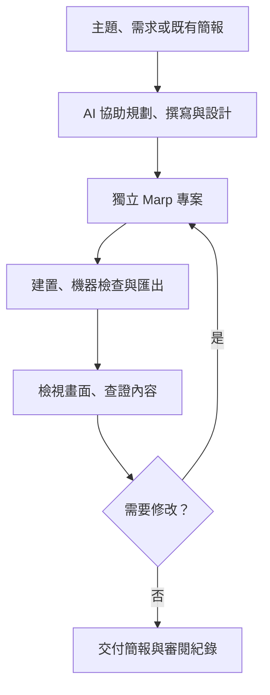

# RAS — RAISE A SLIDE

[English](README.md) · [臺灣華語](README.zh-TW.md)

把主題或大綱做成能夠排練、上台使用的簡報。
RAS 是受 RAISE A SUILEN 啟發的獨立 AI 外掛，也是一套可攜式 Marp 專案工具。
每份產生的簡報都是能獨立運作的專案。

RAS 的原創程式碼、文件與範本採 [MIT 授權](LICENSE)。這是非官方專案，
與作品及其權利人沒有隸屬、贊助或背書關係；詳見[權利聲明](NOTICE.md)。
軟體授權不包含第三方角色或商標權利。

## 可以做什麼

- 從需求整理敘事大綱、投影片文字與講者備註。
- 修改既有演講，保留作者語氣與逐步揭露的順序。
- 建置 HTML、匯出 PDF 與備註，並產生每頁預覽供檢查。
- 檢查頁數、本機資源、字型載入、文字大小、溢出與裁切。
- 分開管理事實查證、素材來源與上台提示。
- 查核提供的圖片是否符合使用條件，以及是否需標示創作者／權利人。

AI 宿主提供模型與工具；JavaScript 腳本負責建置及驗證，不會呼叫 AI API。
創作流程需要 AI 宿主，產生的簡報專案則可以自行建置。

## 在本機閱讀文件

在本儲存庫執行一次 `npm ci`，再啟動文件網站：

```sh
npm run docs
```

開啟[臺灣華語文件](http://127.0.0.1:4174/zh-TW/)或 [English documentation](http://127.0.0.1:4174/en/)。
頁首切換語言時會保留目前文件，導覽與內容一起切換，Mermaid 也在本機繪製。
修改 Markdown 後重新整理即可，可用 `PORT` 改變連接埠。
這個指令預覽儲存庫文件；下方的簡報預覽指令則在初始化後的簡報專案內執行。

## 建立獨立簡報

需要 Node.js 22.18 以上版本與 npm。在本儲存庫執行：

```sh
node scripts/ras.mjs init ../my-talk
cd ../my-talk
npm ci
npm run doctor
npm run export
npm run preview
```

接著編輯 `brief.md`、`slides.md`、`sources.md` 與 `theme.css`。
初始專案包含可直接執行的十頁原創範例 **Give one idea a stage**，可替換成自己的內容。
產生器會複製建置工具與鎖定相依套件版本的檔案；即使把專案移離本儲存庫，仍可獨立使用。
目標目錄必須尚未存在。

安裝 npm 相依套件與 Puppeteer 瀏覽器時需要網路。
若瀏覽器未安裝，可執行 `npx puppeteer browsers install chrome`，
或設定 `RAS_BROWSER_PATH` 指向既有的 Chrome／Chromium 執行檔。
安裝完成後，建置使用本機字型、圖片與預先繪製的 Mermaid 圖表。

以下指令在產生的簡報專案內執行：

| 指令 | 結果 |
| --- | --- |
| `npm run build` | 在 `dist/` 產生 HTML 與備註 |
| `npm run check` | 重新建置、執行自動檢查並產生 PNG 預覽 |
| `npm run export` | 通過機器檢查後匯出 PDF，並確認頁數 |
| `npm run preview` | 在 `http://127.0.0.1:4173` 開啟本機預覽服務 |
| `npm run doctor` | 診斷 Node、瀏覽器與設定 |
| `npm run status` | 顯示機器檢查、審閱狀態，以及過期的證據 |
| `npm run review:record -- <review.json>` | 記錄實際完成的視覺或事實審閱 |
| `npm run memory -- list` | 讀取目前專案儲存的偏好 |

每次建置都會替換 `dist/`，原始素材請放在 `assets/`。
預覽服務提供 `dist/` 的內容；修改來源後需重新建置並重新整理頁面。
可用 `PORT` 指定其他本機連接埠。Marp HTML 支援鍵盤換頁與講者模式。
**HTML 包含講者備註；只要提供觀眾投影片時，請使用 PDF。**

## 搭配 Codex、Claude Code 或開放模型

所有入口共用同一組 skills 與工作流程。模型由宿主選擇，RAS 不要求特定供應商或 API 金鑰。
完整製作流程需要檔案與 shell 工具；純聊天模式可以起草檔案內容，再由使用者執行獨立工具建置與驗證。

### Claude Code

將本儲存庫載入為本機外掛：

```sh
claude --plugin-dir /path/to/ras
```

接著使用 `/ras:create`、`/ras:revise`、`/ras:review`、`/ras:export`、
`/ras:remember` 或 `/ras:retro`。
每個操作都是共用 skill，不需要另外維護命令定義。
Claude Code 會[自動掃描外掛的 `skills/` 目錄](https://code.claude.com/docs/en/plugins-reference#skills)，
因此 Claude manifest 不需要 `skills` 欄位；本儲存庫的 `skills` 與 `interface` 欄位位於 `.codex-plugin/plugin.json`。

### Codex

儲存庫提供可攜式 `plugin.json` 與相容的 `.codex-plugin/plugin.json` 供外掛封裝使用。
若要立即在本機使用，可採用下列專案 skill bundle，或直接指定操作的 skill 檔案。
建立或下載本儲存庫不會自動把它安裝到 Codex。

專案內的替代安裝方式：將 `SKILL.md`、`skills/`、`references/`、`agents/`、
`profiles/`、`templates/`、`scripts/`、`docs/`、`LICENSE`、`NOTICE.md`、套件 manifest 與鎖定檔，以及 `.gitignore`，
一起複製到目標專案的 `.agents/skills/ras/`，然後開啟新工作階段。
請保留整組檔案的相對路徑；只複製 `SKILL.md` 會缺少必要資源。

可以用自然語言，或透過模型端的路由器提出需求：

```text
ras:create brief.md
ras:create 用 15 分鐘向初階工程師說明重試策略 --plan
ras:revise talks/retries/slides.md 把開場縮短到兩分鐘
ras:review talks/retries/slides.md
ras:export talks/retries/slides.md
ras:remember 在 talks/retries 裡，先說明問題再展示程式碼
ras:retro 回顧這次工作階段，找出適合留在 talks/retries 的經驗
```

宿主的命令探索方式各有不同；路由器不會註冊原生斜線命令，也不保證自動完成。
也可以直接請 AI 讀取本儲存庫的 `skills/<operation>/SKILL.md`。

### 開放模型與沒有外掛探索功能的宿主

只需要 Node.js，就能將指定 skill、共用規則與角色指示展開成完整提示詞：

```sh
node /path/to/ras/scripts/ras.mjs prompt create \
  '用 15 分鐘向初階工程師說明重試策略，建立在 ./talk。' > ras-request.md
```

直接使用 **Ollama 或本機聊天介面**時，請明確指定聊天模式：

```sh
node /path/to/ras/scripts/ras.mjs prompt create --chat \
  '用 15 分鐘向初階工程師說明重試策略。' > ras-chat.md
ollama run YOUR_MODEL < ras-chat.md
```

也可以把 `ras-chat.md` 貼進聊天介面，並提供模型無法讀取的需求或來源檔案內容。
將它回傳的具名草稿存入以 `init` 建立的專案，再執行 `npm run export`。
純聊天模式只會提供檔案內容與待執行指令，無法自行寫檔、瀏覽來源、檢視圖片或匯出。

`prompt revise`、`prompt review`、`prompt export`、`prompt remember` 與 `prompt retro`
會展開對應操作；建立簡報時加上 `--plan` 仍只產生計畫。
聊天模式的記憶操作只提出條目與儲存步驟，不會宣稱已儲存。

若要透過 Codex 本機 provider 使用具備工具能力的模型：

```sh
codex exec --oss --local-provider ollama -m YOUR_MODEL \
  --sandbox workspace-write --skip-git-repo-check - < ras-request.md
```

請先啟動本機 provider 並安裝合適的模型；Codex 也接受 `--local-provider lmstudio`。
RAS 不會代選或下載模型，也不會修改 provider 設定。
模型的工具使用、上下文容量與寫作品質各有差異；這個轉接方式不代表所有模型都經過驗證。

## 製作團隊

| 角色 | 責任 |
| --- | --- |
| 🎧 CHU² | 果斷的製作人：整理需求、確立論點、協調與確認完成 |
| 🎤 LAYER | 沉穩的寫作者：投影片文字、轉場與講者備註 |
| 🎹 PAREO | 細心的設計者：主題、視覺層次與畫面檢查 |
| 🎸 LOCK | 認真的實作者：Marp 原始碼、建置與具體修正 |
| 🥁 MASKING | 直接可靠的審閱者：清晰度、節奏與證據 |

這些角色代表責任分工，不強制呼叫五個代理；宿主可以依序完成各輪工作。
講者決定演講內容，角色風格用於協作對話，投影片風格則依每份簡報選擇。
若希望使用一般語氣，可以要求省略角色標籤與口吻。



建立流程為 **CHU² → LAYER → PAREO → LOCK → 視覺檢查 → MASKING → CHU²**。
審閱發現問題後，交回負責的角色修正，再重新建置、檢查。
每次交接都附上檔案路徑與實際證據。
[工作流程](docs/workflow-zh-tw.md)另有修改、審閱、匯出與只做計畫的路線。
單一模型依序執行時，會如實說明，不能宣稱有獨立代理審閱。

可選用的 [Wei profile](profiles/wei.md)整理了短句、大字、逐步揭露、程式碼／圖表與少量幽默等偏好。
研討會、公司識別與個人插圖屬於各簡報專案。

## 品質與範圍

機器檢查通過後，視覺與事實審閱仍是 **pending**。
請檢查最新 PNG 與來源，再以審閱前取得的雜湊、實際頁面涵蓋範圍與觀察結果執行 `review:record`。
`status` 會在原始碼、需求、大綱或來源改變時指出過期紀錄。
匯出可用於草稿，驗證報告會保留實際狀態；上台時間在排練前都只是估計。
詳見[審閱與驗證](docs/review-zh-tw.md)。

所有提供或選用的圖片（含截圖與背景）都依[圖片權利與標示](docs/image-rights-zh-tw.md)查核。
在 `sources.md` 記錄使用依據與標示判定，並在觀眾版 HTML／PDF 檢查必要文字。
未知權利或漏標時，簡報維持未完成審閱；這是審閱者的查核，建置腳本不會自動判定合法使用。
獨立專案自帶相同指南；`licenses/README.md` 說明授權適用範圍，
`licenses/ras/MIT.txt` 保留隨附 RAS 工具與範本的標準 MIT 授權。講者自行決定內容的授權。
建置與匯出會將此目錄保留在 `dist/licenses/`。

`ras:remember` 將明確要求記住的偏好存入所選專案的 `.ras/memory.json`，該檔案由 Git 忽略。
`ras:retro` 從實際工作階段提出經驗，儲存使用者選定的項目。
相關條目會協助後續操作，但不會蓋過目前需求；也不會讀取家目錄記憶庫或隨投影片匯出。
詳見[專案記憶](docs/memory-zh-tw.md)。

初版支援新建、修改、審閱，以及 HTML／PDF 匯出。
舊簡報的局部轉換用來驗證風格，三份舊演講的整批遷移暫緩。
起始主題使用鎖定版本的 Noto Sans TC Variable，支援繁體字的臺灣華語內文、標題與程式碼註解；
Mermaid 會內嵌標籤字型。其他文字系統或品牌字型可放入專案並附上授權。
詳見 [Marp 撰寫指南](docs/marp-zh-tw.md)。

本儲存庫不收錄歷史投影片摘錄、角色圖片、雇主標誌、第三方迷因或字型檔案。
參考測試素材放在儲存庫外；相依套件與產出由 Git 忽略。
字型透過套件安裝，必要的授權聲明保留在產出中。

`npm run validate` 會依來源路徑允許清單，檢查暫存區內容、已追蹤檔案的工作副本，
以及未被忽略的新檔案，要求一般 UTF-8 文字檔。
未知格式或目錄、二進位內容與符號連結都會被拒絕，尚未暫存的修改也會檢查。
已刪除的工作副本仍會檢查索引內容。
沒有 Git 資訊時，會明確回報略過來源檔案檢查，但仍驗證 metadata 與 skill；素材來源仍需審閱。

## 文件導覽

| 文件 | 內容 |
| --- | --- |
| [工作流程](docs/workflow-zh-tw.md) | 角色分工、各操作路線與交付方式 |
| [Marp 撰寫指南](docs/marp-zh-tw.md) | 投影片、備註、主題、Mermaid 與本機素材 |
| [審閱與驗證](docs/review-zh-tw.md) | 機器檢查、視覺／事實審閱與紀錄有效性 |
| [圖片權利與標示](docs/image-rights-zh-tw.md) | 提供圖片的使用依據、權利人標示與最終產出查核 |
| [專案記憶](docs/memory-zh-tw.md) | remember、retro、儲存範圍與優先順序 |
| [開發與自動化](docs/development-zh-tw.md) | 本機檢查、CI、版本與發布 |
| [相依套件版本](docs/dependencies-zh-tw.md) | 固定版本、CVE 對照與字型 |
| [驗證紀錄](docs/validation-zh-tw.md) | 已執行的驗證、歷史證據與測試限制 |

## 開發

在本儲存庫執行：

```sh
npm ci
npm run validate
npm test
npm run test:mutation
```

GitHub CI 在 Ubuntu／macOS、Node 22.18.0／26.9.0 上執行檢查，並匯出獨立起始專案。
PR 直接執行 CI；推送至 `main` 時，通過同一組 CI 後才執行版本與發布工作。
Conventional Commits 驅動 npm 與三份外掛 manifest 的版本更新、變更紀錄及 GitHub Release。
設定、本機指令與發布權限請見[開發與自動化](docs/development-zh-tw.md)。

腳本採用專案相對路徑，瀏覽器可另行指定。
行為測試涵蓋來源解析、獨立初始化、素材缺漏與版面錯誤；瀏覽器測試需要 Chrome／Chromium。
相依套件覆寫會固定已修補的 `@xmldom/xmldom`，並讓 `puppeteer-core` 與 Puppeteer 25 對齊。
請以本次產生的報告作為測試證據，歷史驗證紀錄不代表目前版本已通過。

## 參考資料

- [Marp CLI](https://github.com/marp-team/marp-cli)
- [Marpit 備註與繪製](https://github.com/marp-team/marpit/blob/main/docs/usage.md)
- [Mermaid CLI](https://github.com/mermaid-js/mermaid-cli)
- [OpenAI 外掛封裝](https://developers.openai.com/plugins/build/plugins)
- [Claude Code 外掛](https://code.claude.com/docs/en/plugins)
- [RAISE A SUILEN](https://bang-dream.com/artist/raise-a-suilen/)
