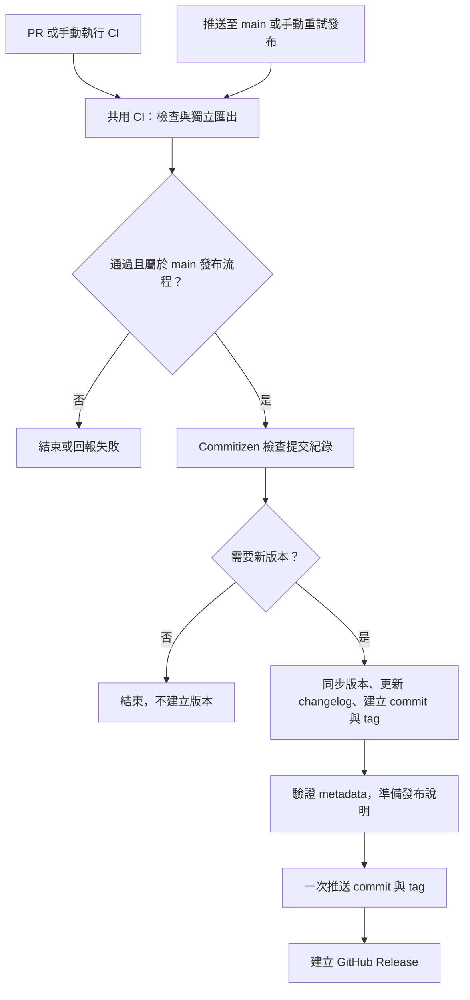

# 開發與自動化

[English](development.md) · [臺灣華語 README](../README.zh-TW.md)

## 文件網站

安裝 `npm ci` 後，在本儲存庫執行 `npm run docs`。
網站位於 `http://127.0.0.1:4174`，`/zh-TW/` 提供臺灣華語，`/en/` 提供英文。
可用 `PORT` 改變連接埠，服務只監聽本機回送介面。

`scripts/docs-pages.mjs` 管理每頁的兩種語言來源與介面文字；新增頁面時一併加入兩個版本。
網站直接讀取既有 README、`docs/` 與 `references/`，不需要維護另一份產生的內容。
修改來源後重新整理即可。語言切換保留目前頁面，內文連結也會轉成對應的語言路徑。
共用的角色／skill 規格仍以英文維護，在臺灣華語介面中會明確標示。

繪製使用已鎖定的 Marp／Mermaid 工具鏈中的 Markdown 與 Mermaid 相依套件，
直接提供已安裝套件的模組，不把第三方資源複製進儲存庫來源。
`npm test` 涵蓋成對語言路徑、導覽、Mermaid 繪製與本機檔案範圍。
文件服務是儲存庫工具，不會複製進產生的簡報專案。

## CI

`.github/workflows/ci.yml` 在 PR 與手動觸發時執行，也可由主分支的發布工作流程呼叫。
測試矩陣涵蓋 Ubuntu 24.04、macOS 15，以及 Node 22.18.0、26.9.0。
每個工作會安裝鎖定版本的相依套件與 Puppeteer 指定的 Chrome、驗證儲存庫來源、執行測試及匯出／預覽突變測試，
並在 checkout 目錄外初始化、安裝與匯出獨立起始簡報。
匯出涵蓋 Mermaid、字型、備註、PNG 與 PDF；產生的媒體只作暫存，不提交或發布。

Ubuntu 使用限縮範圍的 AppArmor profile，允許 CI 瀏覽器快取中的執行檔使用 user namespaces，
依據 [Chromium 指南](https://chromium.googlesource.com/chromium/src/+/main/docs/security/apparmor-userns-restrictions.md)設定。
瀏覽器仍使用 sandbox；本機開發環境不需要因此修改 AppArmor。



在儲存庫內執行本機檢查：

```sh
npm ci
npm run validate
npm test
npm run test:mutation
npm run test:release
actionlint .github/workflows/ci.yml .github/workflows/bumpversion.yml
```

`actionlint` 用於工作流程語法檢查；`test:release` 另外需要 Git 與 uv。
這些是儲存庫維護工具，產生的簡報專案只需要自己的 Node.js 相依套件。

## 版本與發布

推送至 `main` 時，`.github/workflows/bumpversion.yml` 先執行共用 CI。
通過後，由 Commitizen 4.16.2 依 `.cz.toml` 解析 Conventional Commits：
`feat` 提升次版本，`fix` 提升修訂版本；沒有符合發布條件的變更時不建立版本。
`major_version_zero` 啟用期間，套件維持主版本零。

[npm version provider](https://github.com/commitizen-tools/commitizen/blob/v4.16.2/commitizen/providers/npm_provider.py)
更新 `package.json` 與 `package-lock.json` 的兩個根版本欄位；
明列的版本檔案清單會更新 `plugin.json`、`.claude-plugin/plugin.json` 與 `.codex-plugin/plugin.json`。
Commitizen 也更新 `CHANGELOG.md`、建立版本提交與附註式 `v…` tag。
工作流程驗證更新後的 metadata、準備發布說明，再以原子操作推送 commit／tag，於同一工作建立 GitHub Release。
這個流程不發布到 npm。

`npm run test:release` 將儲存庫來源複製到暫存 Git 儲存庫，以固定版本的 Commitizen 測試：
首次功能版本、立即重跑、只有文件變更的後續提交，以及之後的修訂版本。
首次測試情境沒有歷史 tag，因此不複製原有 changelog；後續情境再以產生的 changelog 與 tag 歷史測試。
檢查內容包括版本同步、相依版本保持不變、tag／changelog、發布說明、來源驗證與兩種不升版的結果。
測試不會推送、發布或修改目前儲存庫的歷史。

合併至 `main` 的變更採用 Conventional Commit 訊息。
發布工作需要 GitHub Actions 的 `contents: write` 權限，分支規則也必須允許發布機器人的版本提交。
發布工作限定於 `Lee-W/ras`；fork 若要自行發布，需先調整儲存庫條件。

可在 `main` 手動重試尚未完成的發布。推送遭拒會直接失敗，不強制推送或移動分支；
請依目前 `main` 重跑。若推送成功但建立 Release 失敗，應從已推送的 tag 補建 GitHub Release，
避免再次產生版本。

本機查看版本或預覽升版：

```sh
uvx --from commitizen==4.16.2 cz version --project
uvx --from commitizen==4.16.2 cz bump --dry-run --yes
```

CI 成功只代表實際執行的檢查通過；投影片美感、主張正確性與現場時間仍需另外審閱及排練。
