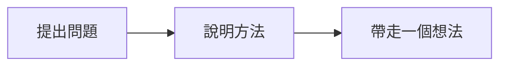

# Marp 撰寫指南

[English](../references/marp.md) · [臺灣華語 README](../README.zh-TW.md)

使用 `slides.md`，在開頭加入 YAML frontmatter，以 `---` 分隔投影片。
投影片 Markdown 重複使用 `#` 標題很正常，不套用部落格的標題或 metadata 規則。
頁數以 Marp 解析結果為準，不能靠比對水平線的正規表示式計算；
frontmatter、程式碼區塊、備註與分隔線都需要正確解析。

```markdown
---
marp: true
theme: ras
size: 16:9
paginate: true
title: 我的演講
---

<!-- _class: statement -->
# 一次說清楚一個想法。

<!-- 在這裡停一下，請觀眾舉一個例子。 -->

---

<!-- _class: image -->

```

範例圖片路徑需要替換成自己提供的素材。

## 主題與備註

可用的主題 class 包括 `title`、`section`、`statement`、`image`、`code`、`compare` 與 `closing`。
沒有 class 的投影片採用標題加內文版型。
`_class` 只影響當頁，`class` 會持續套用到後面的頁面。
CSS 主題以 `/* @theme ras */` 宣告，`theme.css` 由專案自行維護。

`.accent` 用於重點色，`.muted` 用於次要文字，`.credit` 用於圖片出處，
`.label` 用於圖表或框線上的小標籤（字級門檻比照 `minCreditSize`），
`.columns` 用於兩欄比較。這些已知的本機版型可以使用原始 HTML；
一般文字、清單、表格與程式碼仍採 Markdown。
文字太多時，優先縮短句子或拆頁，避免一味縮小字體。不要另創色彩 token 或 metadata 語法。

提供的圖片先依[圖片權利與標示](image-rights-zh-tw.md)查核，必要文字以 `.credit` 放在可見位置。
HTML 註解與講者備註不會成為 PDF 中觀眾看得到的標示。
依實際條款保留指定文字、連結與修改說明，不猜測著作權人。

HTML 註解會成為講者備註，除非 Marp 將它辨識為指令。
備註內容避免包含 `-->`；示範 HTML 註解語法時，請放進 fenced code block。
編輯後要確認備註仍對應正確頁面。

## Mermaid 與圖表

在可編輯的 `slides.md` 保留 Mermaid 程式碼區塊：

````markdown

````

建置時，固定版本的 Mermaid CLI 與瀏覽器會將區塊轉成專案內的 SVG，
再以一般圖片引用放進產生的來源。既有 SVG 與截圖放在 `assets/`。
純文字 ASCII 圖使用 `text` 程式碼區塊；彩色 ASCII 圖可用已跳脫特殊字元的
`<pre class="ascii">` 搭配色彩 span。

## 本機素材與字型

圖片等素材放在 `assets/`。檔名含空格時，使用合法的 Markdown URL 跳脫或角括號。
建置會複製固定版本的拉丁字型與 Noto Sans TC Variable，並保留授權。
起始主題以 `RAS CJK` 作為臺灣華語內文、標題與程式碼註解的後備字型。
Mermaid 先載入標籤字型再計算版面，並將需要的字型子集內嵌至 SVG，支援離線使用。

其他文字系統或自訂品牌字型，請將字型與授權放入 `assets/`，在 `theme.css` 宣告並檢視實際畫面。
簡報必要的媒體與字型使用本機資源。來源引用可以使用 HTTP 連結；
繪製時需要連線載入的遠端資源會被離線檢查攔下。

初版輸出 HTML、PDF、備註與 PNG 預覽，不保證可編輯的 PowerPoint 輸出，
也不保證任意 HTML 都能無損轉成 Marp。

## 參考簡報轉換

使用者要求局部轉換時，先讀原始檔與截圖，保留文字、揭露順序、備註、程式碼、
圖片出處與原本的視覺層次。在 `sources.md` 記錄頁面對照。
過時的主張另外提出，不在格式轉換時默默改寫。

Wei 的舊格式對照：

| 舊格式 | Marp 寫法 |
| --- | --- |
| `layout:` | `_class` |
| `::: notes` | HTML 註解 |
| `{br}` | `<br>` |
| 色彩 token | span |

舊工具會將 fenced `html` 區塊當作 HTML 繪製，需要明確轉換，不能直接保留為程式碼區塊。
保留空白標題頁，只重建版型需要的包裝結構。

有些舊專案把整份簡報放在單一 Markdown 檔，以 `## ` 標題切成投影片，講者備註為純文字。
Markdown 格式化工具或 linter 可能默默破壞這種檔案：備註中以 `#` 開頭的行
（例如換行後單獨成行的 PR 編號 `#65451.`）會被當成標題，
格式化工具接著把之後所有的 `## ` 降級為 `### `。切頁程式只比對 `^## `，
於是這些投影片被併進前一頁，建置卻仍回報成功，只是頁數少了許多。
這種檔案不該有任何合法的三級標題，所以用 `grep "^### " <file>` 偵測：
只要有命中就是已損壞，單靠檢查投影片頁數發現不了。
修復方式是把每個 `### ` 升回 `## `，並把落單的 `#NNNN` 接回前一行。
若結尾標點（`?`、`.`、`!`）仍在，代表格式化工具的結尾標點規則（MD026）沒有執行，
層級位移可以完整還原。另外兩種已知的格式化損壞是：MD026 刪掉標題結尾的標點（無法還原），
以及 MD009 刪掉單獨一行的 `##`。讓切頁程式在看到任何 `^### ` 時拒絕建置。
在轉換後的 RAS `slides.md` 中，備註放在 HTML 註解裡，格式化工具不會動它。
