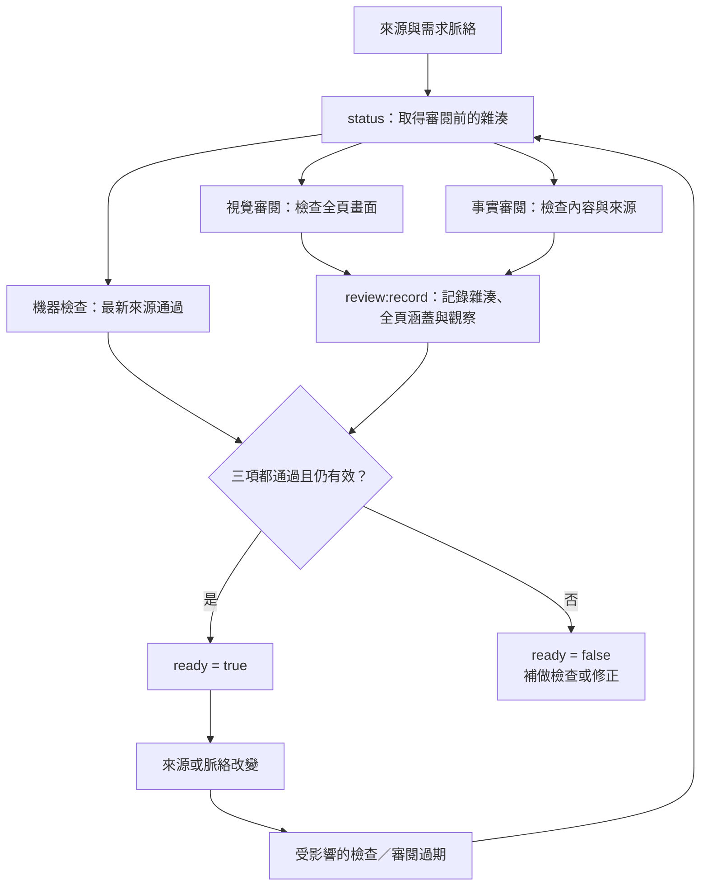

# 審閱與驗證

[English](../references/review.md) · [臺灣華語 README](../README.zh-TW.md)

建置成功之外，內容與視覺也需要各自審閱。

## 內容審閱

閱讀需求與整份簡報，包含備註。檢查核心論點、對觀眾的假設、轉場、程式碼與主張是否一致、
來源標示，以及最後是否回應開場。依使用者指定範圍操作：`review` 回報問題，`create`／`revise` 可以修正。
以最新建置的「標題＋頁碼」指出問題位置。

講者備註用於上台提示；要檢查內容是否有幫助，不能只確認備註存在。
估算各段時間並建議可刪內容，在講者排練前標為未驗證。
不要用固定的每分鐘頁數限制演講。

對所有圖片（包含使用者提供的素材）執行[圖片權利與標示查核](image-rights-zh-tw.md)。
在 `sources.md` 記錄使用依據、是否需要標示、必要文字與證據，並在事實審閱觀察欄記錄結果。
未知使用權利或缺少必要標示時，不得記錄通過的事實審閱；舊紀錄若沒有圖片查核證據，需要重新審閱。
視覺審閱實際檢查最終 HTML 與觀眾版 PDF 的標示。
這是依據證據執行的審閱規則，腳本不會自行判定合法使用。

## 機器檢查

`npm run check` 會建置目前來源，以本機瀏覽器開啟全部頁面、封鎖遠端網路資源，
等待字型與圖片載入，並回報溢出、文字裁切、內文／程式碼過小、缺圖、瀏覽器錯誤與頁數不一致。
結果寫入 `.ras/check.json`，預覽放在 `.ras/previews/slide-NNN.png`。

`npm run export` 要求機器檢查通過，接著匯出 PDF、比對 PDF 與 Marp 頁數，
並寫入 `dist/verification.json`。講者備註另存為 `dist/notes.txt`，不會加成 PDF 註解。
HTML 講者模式含備註，適合作為講者使用的檔案；提供觀眾時可選只含投影片的 PDF。

版面問題應修改來源或主題，不直接改產生的 HTML，也不為了消除錯誤而降低檢查門檻。
可以刻意使用滿版圖片，但非預期的文字重疊與裁切仍須修正。
視覺與事實審閱在記錄前保持 pending，自動檢查不能代為認證。

## 視覺檢查

以圖片或瀏覽器檢視每一頁最終畫面；縮圖總覽可協助找出需要放大的頁面。
檢查視覺層次、留白、圖片裁切、對比、換行、程式碼／表格可讀性、圖表與連線、出處標示、
共用視覺元素的一致性及揭露順序。換頁操作與講者備註另外測試。

修改後重新檢視繪製結果。迭代時可以只看受影響的頁面，最終交付前要涵蓋最新版本的整份簡報。
在 `review.md` 記錄來源雜湊、檢查頁面、實際觀察與未解決問題。
舊畫面的審閱不能當作新來源雜湊的證據。

## 記錄與有效性

在簡報專案內執行 `npm run status`，取得 `sourceHash`、`contextHash`、
機器檢查與各類審閱的有效性，以及 `ready`。
這個指令只讀取狀態，不建置、不看圖，也不修改專案。

`sourceHash` 涵蓋繪製輸入；`contextHash` 另外涵蓋 `brief.md`、`outline.md` 與 `sources.md`，
包括這些檔案的新增或刪除。觀眾或場地改變也可能影響視覺適切性，因此脈絡變更會讓兩種審閱失效。
若繪製輸入沒變，機器檢查仍有效。



完成實際審閱後，在 `.ras/` 準備 JSON 紀錄，使用**審閱前**取得的雜湊：

```json
{
  "kind": "visual",
  "sourceHash": "<審閱前 status 顯示的 sourceHash>",
  "contextHash": "<審閱前 status 顯示的 contextHash>",
  "verdict": "passed",
  "reviewer": "審閱者姓名或實際使用的模型／宿主",
  "pages": [1, 2],
  "observations": "實際檢查範圍、觀察到的問題及修正結果。"
}
```

論點與來源審閱使用 `kind: factual`；有必要修正的問題時使用 `verdict: needs_changes`。
通過紀錄必須列出每一頁，局部檢查不能讓整份簡報通過。
範例中的頁碼與觀察內容都必須替換為實際證據，詳細問題可另存 `review.md`。

```sh
npm run review:record -- .ras/visual-review.json
npm run status
```

工具會拒絕過期雜湊、缺少觀察、無效頁碼，以及沒有涵蓋全頁的通過紀錄。
接受的紀錄保存在 `.ras/reviews.json`。

| 狀態 | 意義 |
| --- | --- |
| `pending` | 尚未記錄檢查或審閱 |
| `passed` | 已通過 |
| `needs_changes` | 審閱指出必要修正 |
| `stale` | 紀錄對應的來源或脈絡已改變 |
| `invalid` | 紀錄格式或內容無效 |
| `failed` | 機器檢查失敗；此狀態僅用於機器檢查 |

`ready` 要求目前的機器檢查、視覺審閱與事實審閱全部通過且有效。
紀錄是審閱者的聲明，工具本身不能證明某個人或模型真的執行過審閱。

草稿仍可匯出；匯出報告會呈現目前審閱狀態，不會自動讓視覺或事實審閱通過。
重新建置不會清除已接受的紀錄，但來源或脈絡變更會使其過期。
沒有這些輔助工具的舊專案，在明確升級前繼續採用手動審閱規範。
