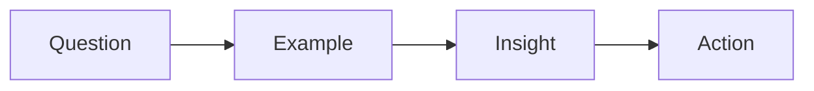

<!-- _class: title -->
# Give one idea<br>a **stage**.

RAISE A SLIDE · A five-minute example

<!-- Open with the title. Ask the audience to think of the last presentation they remembered. -->

---

<!-- _class: statement -->
# What should they<br>**remember**?

<!-- Pause. Give people time to choose one thing. This question defines the talk's purpose. -->

---

<!-- _class: statement -->
# Start there.

<!-- The answer is the brief. We can choose the supporting evidence after we know what it should establish. -->

---

<!-- _class: section -->
# Build the argument.

One useful step at a time.

<!-- Transition from the central takeaway to the structure of the talk. -->

---

# Give each slide a job.

| Job | What the audience gains |
| --- | --- |
| Set up | A question worth answering |
| Explain | A model they can follow |
| Show | Evidence they can inspect |
| Resolve | A next step they can take |

<!-- Walk through the four jobs. These are possible functions, not a required four-slide template. -->

---

# Make the sequence visible.



<!-- Use this diagram to explain the proposed progression. The diagram is rendered before presentation time. -->

---

<!-- _class: compare -->
# Screen and voice work together.

<div class="columns">
<div><h2>On screen</h2><p>A short claim.</p><p>A useful image.</p><p>A readable example.</p></div>
<div><h2>In your voice</h2><p>The explanation.</p><p>The transition.</p><p>The reason it matters.</p></div>
</div>

<!-- Explain the division of work. Speaker notes are cues, rather than paragraphs to read aloud. -->

---

<!-- _class: code -->
# Show just enough code.

```python
def prepare_talk(audience, takeaway):
    outline = build_argument(takeaway)
    return adapt_examples(outline, audience)
```

An illustrative example, not a library API.

<!-- This is pseudocode. Keep the example small enough to explain without asking the audience to read ahead. -->

---

<!-- _class: statement -->
# Leave room<br>for a **pause**.

<!-- Demonstrate the pause. Wait before moving to the final page. -->

---

<!-- _class: closing -->
# What will they<br>**remember**?

Start the rehearsal with that question.

<!-- Return to the opening question. Invite questions. The five-minute duration is an intended budget until rehearsed. -->
